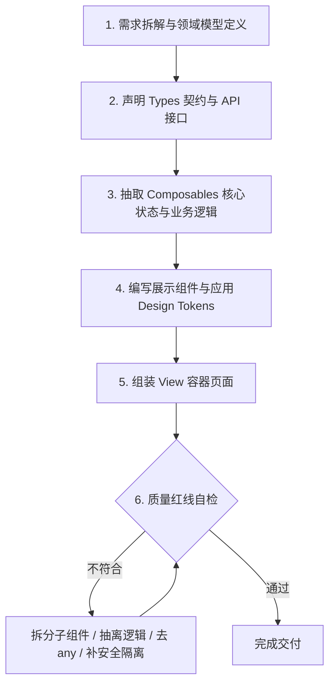

# 现代通用 Web 全栈开发框架与设计系统规范 (Web App Framework & Design System)

本规范为通用的现代 Web 全栈项目提供统一的**工程架构标准**、**高级质感 Design System (Bento Grid + Glassmorphism)** 以及**代码质量红线**。

无论是从零创建新项目，还是在现有项目中迭代新页面与新模块，均须严格遵循本规范。

---

## 目录索引
1. [项目顶层架构与 Monorepo 目录规范](#1-项目顶层架构与-monorepo-目录规范)
2. [Design System 视觉规范与 CSS Tokens](#2-design-system-视觉规范与-css-tokens)
3. [核心 UI 组件设计与交互标准](#3-核心-ui-组件设计与交互标准)
4. [前端工程架构与状态流规范](#4-前端工程架构与状态流规范)
5. [代码质量红线与防腐机制 (Code Quality Rules)](#5-代码质量红线与防腐机制-code-quality-rules)
6. [AI 辅助开发标准化工作流与自检清单](#6-ai-辅助开发标准化工作流与自检清单)

---

## 1. 项目顶层架构与 Monorepo 目录规范

项目统一采用 **全栈式单体仓库 (Fullstack Monorepo)** 架构，前端采用 `pnpm workspace` 治理，后端独立解耦，统一通过根目录脚本与 Docker 编排调度。

### 1.1 标准顶层目录树
```text
<project-root>/
├── .agents/                 # AI 辅助技能与规则库 (Skills & Rules)
│   └── skills/
│       └── web-app-framework/
│           └── SKILL.md
├── apps/                    # 业务应用层 (多应用隔离)
│   ├── web/                 # 前端应用 (Vue 3 / React + Vite + TypeScript)
│   │   ├── src/             # 前端源代码 (详见前端目录规范)
│   │   ├── public/          # 静态公共资源
│   │   ├── package.json     # 前端独立依赖声明
│   │   └── vite.config.ts   # Vite 构建与代理配置
│   └── api/                 # 后端应用 (Python FastAPI / Node.js / Go)
│       ├── src/             # 后端业务逻辑层
│       ├── tests/           # 单元测试与集成测试
│       └── pyproject.toml   # 后端环境与依赖
├── docker/                  # 容器构建文件专用目录
│   ├── web.Dockerfile       # 前端生产 Nginx 构建配置
│   └── api.Dockerfile       # 后端运行环境构建配置
├── docs/                    # 项目设计方案、需求与配置文档
│   ├── architecture.md      # 系统架构与模块图解
│   └── setup-guide.md       # 本地与线上部署手册
├── scripts/                 # 自动化运维、数据库迁移、初始化脚本
├── data/                    # 本地开发测试数据与种子文件 (Git Ignore)
├── uploads/                 # 用户上传静态存储目录 (Git Ignore)
├── logs/                    # 统一运行日志目录 (Git Ignore)
├── .env.example             # 环境变量模板声明
├── docker-compose.yml       # 全栈本地一键编排 (Web + API + DB + Redis)
├── package.json             # 根目录全局调度脚本 (pnpm dev / build / typecheck)
├── pnpm-workspace.yaml      # Monorepo 工作区配置文件
└── README.md                # 项目简介与快速上手指南
```

### 1.2 前端 `apps/web/src` 标准分层
```text
apps/web/src/
├── api/                     # 接口请求层 (Axios 实例与各领域 API 函数)
├── assets/                  # 本地静态图片、SVG 图标、字体
├── components/              # 组件层
│   ├── common/              # 纯展示/原子级通用组件 (Button, Card, Modal, Tag)
│   └── business/            # 领域复合业务组件 (ChatBox, UserMenu, MetricChart)
├── composables/             # 组合式业务逻辑 (useAuth, useChatStream, useTheme)
├── router/                  # 路由配置与动态守卫 (index.ts, routes.ts, guards.ts)
├── stores/                  # Pinia 状态管理 (分模块: user.ts, chat.ts, app.ts)
├── styles/                  # 全局样式与 Token 体系
│   ├── tokens.css           # CSS 变量定义 (颜色、圆角、阴影、间距)
│   └── main.css             # 全局 Reset、排版、滚动条、通用工具类
├── types/                   # 全局 TypeScript 类型定义与 DTO/VO 契约
└── views/                   # 页面级容器组件 (路由入口页面)
```

---

## 2. Design System 视觉规范与 CSS Tokens

现代高级感 Web 界面核心：**柔光微渐变底色 + 毛玻璃 (Glassmorphism) 材质 + Bento 栅格布局 + 多层弥散软阴影**。

### 2.1 全局 CSS Tokens 模板 (`styles/tokens.css`)
```css
:root {
  /* 1. 字体系统 */
  --font-family-base: Inter, "PingFang SC", "Hiragino Sans GB", "Microsoft YaHei", -apple-system, BlinkMacSystemFont, system-ui, sans-serif;
  --font-family-mono: "JetBrains Mono", "Fira Code", monospace;

  /* 2. 品牌主色阶 (科技蓝/紫色系) */
  --brand-primary: #4f6ef7;
  --brand-hover: #3b5bdb;
  --brand-active: #2f49b8;
  --brand-subtle: rgba(79, 110, 247, 0.08);
  --brand-glow: rgba(79, 110, 247, 0.24);

  /* 3. 语义功能色 */
  --color-success: #10b981;
  --color-success-subtle: rgba(16, 185, 129, 0.12);
  --color-warning: #f59e0b;
  --color-warning-subtle: rgba(245, 158, 11, 0.12);
  --color-danger: #ef4444;
  --color-danger-subtle: rgba(239, 68, 68, 0.12);
  --color-info: #06b6d4;

  /* 4. 文本与中性色 */
  --text-primary: #172033;
  --text-secondary: #4b5565;
  --text-muted: #8490a5;
  --text-disabled: #bdc5d1;

  /* 5. 材质与表面色 (Light 模式) */
  --bg-app: #f1f5fb;
  --surface-glass: rgba(255, 255, 255, 0.88);
  --surface-solid: #ffffff;
  --surface-hover: rgba(243, 246, 252, 0.9);
  --border-glass: 1px solid rgba(255, 255, 255, 0.8);
  --border-subtle: 1px solid rgba(226, 232, 240, 0.8);

  /* 6. 多层弥散软阴影 (Soft Shadow) */
  --shadow-sm: 0 2px 8px rgba(39, 55, 92, 0.04);
  --shadow-md: 0 8px 24px rgba(39, 55, 92, 0.06);
  --shadow-lg: 0 12px 35px rgba(39, 55, 92, 0.08);
  --shadow-glow: 0 0 20px var(--brand-glow);

  /* 7. 圆角阶梯 (Radius Scale) */
  --radius-xl: 28px;   /* App 胶囊外壳、侧边栏 */
  --radius-lg: 20px;   /* Bento 大卡片、主对话面板 */
  --radius-md: 14px;   /* 子卡片、弹窗内层区域 */
  --radius-sm: 10px;   /* 按钮、输入框、下拉框 */
  --radius-pill: 9999px; /* 状态胶囊、头像徽章 */

  /* 8. 动效时间与缓动 */
  --transition-fast: 0.15s cubic-bezier(0.4, 0, 0.2, 1);
  --transition-normal: 0.25s cubic-bezier(0.4, 0, 0.2, 1);
  --transition-spring: 0.35s cubic-bezier(0.175, 0.885, 0.32, 1.275);
}
```

---

## 3. 核心 UI 组件设计与交互标准

所有项目页面必须使用以下标准组件模板进行构建，保证全网质感与交互体验的一致性。

### 3.1 悬浮胶囊侧边栏 (Floating Pill Sidebar)
- **视觉特征**：`position: sticky; top: 16px; height: calc(100vh - 32px)`，脱离页面顶底，独立圆角悬浮。
- **背景材质**：`background: var(--surface-glass); backdrop-filter: blur(18px); border-radius: var(--radius-xl); border: var(--border-glass)`。
- **导航项状态**：
  - **默认态**：图标与文本柔和灰，透明背景。
  - **Hover 态**：微白底色平滑过渡，右侧图标微抬动效。
  - **Active 激活态**：胶囊高亮背景（`background: var(--brand-subtle); color: var(--brand-primary); font-weight: 600`），左侧带 3px 品牌光条或整体微光阴影。

### 3.2 Bento 风格卡片 (Bento Card)
- **布局哲学**：采用网格化（Grid）划分，信息区块边界清晰，自带 Header / Body / Footer 结构。
- **CSS 实现规范**：
  ```css
  .bento-card {
    background: var(--surface-glass);
    backdrop-filter: blur(16px);
    border: var(--border-glass);
    border-radius: var(--radius-lg);
    box-shadow: var(--shadow-md);
    padding: 20px;
    transition: transform var(--transition-normal), box-shadow var(--transition-normal);
  }
  .bento-card:hover {
    transform: translateY(-2px);
    box-shadow: var(--shadow-lg);
  }
  ```
- **🚨 阴影防裁切间距红线 (Shadow Anti-Clipping Clearance & Negative Spread)**：
  - **多层负 Spread 弥散软阴影**：阴影 Token 必须采用带负 Spread 的多层公式（如 `--shadow-md: 0 8px 24px -4px rgba(23, 32, 51, 0.06), 0 4px 12px -2px rgba(23, 32, 51, 0.03)`），确保阴影完美贴合圆角边缘，杜绝向外投影出硬角。
  - **上下左右防裁切安全间距**：当外层容器（如 `.main-stage`、`.page-viewport`、`.chat-scroll-container`）设置了 `overflow: hidden` 或 `overflow-y: auto` 时，**必须为视口预留至少 16px~20px 的上下左右四周边距（Padding）**。
  - 严禁使 Bento 卡片或 Header 紧贴 `overflow` 容器的顶部（如与上层 HeaderBar 交界处）或左边缘（如与侧边栏交界处），否则卡片向上或向左扩散的弥散软阴影会被容器边界硬切为一条笔直生硬的直角死线（直角切边瑕疵）。侧边栏与主舞台之间必须保持至少 20px~24px 的独立悬浮呼吸间隙。


### 3.3 按钮系统规范 (Button Hierarchy)
1. **Primary Button（主按钮）**：
   - 渐变科技蓝底色 `background: linear-gradient(135deg, var(--brand-primary), var(--brand-hover))`。
   - 白色文本，带轻微下沉投影 `box-shadow: 0 4px 12px var(--brand-glow)`。
   - 点击态（Active）：`transform: scale(0.98)` 微触感回弹。
2. **Secondary Button（次级按钮）**：
   - 浅白半透明表面 `background: rgba(255, 255, 255, 0.85)` + 细微边框 + 深色文本。
3. **Ghost / Text Button（幽灵按钮）**：
   - 无边框透明底，Hover 时展示浅灰色微圆角底色。
4. **Loading 状态**：
   - 按钮置灰禁用，内置 Spin 旋转菊花图标，宽度保持不变防止抖动。

### 3.4 弹窗与抽屉 (Modal & Drawer)
- **遮罩层 (Backdrop)**：
  - 采用 `background: rgba(15, 23, 42, 0.35); backdrop-filter: blur(5px);`，在压暗焦点的同时保持背景柔和虚化。
- **🚨 弹窗卡片本体纯色不透底红线 (Pure Solid Opaque Card)**：
  - ❌ **严禁在浅色模式弹窗中使用半透明毛玻璃底色（如 `rgba(255,255,255,0.85)`）**：由于半透明卡片叠加在深色遮罩上方时，暗色会直接从底层透出，导致整个弹窗呈现发脏、发灰的廉价感。
  - ✅ **浅色模式必须使用 100% 纯白不透底（`background: #ffffff;`）**，搭配微边框 `border: 1px solid rgba(226, 232, 240, 0.9);` 与大景深立体软阴影 `box-shadow: 0 24px 50px -12px rgba(15, 23, 42, 0.22), 0 0 0 1px rgba(0, 0, 0, 0.04);`。
  - ✅ **深色模式使用纯深色表面（`background: #0f172a;`）**，搭配 `border: 1px solid rgba(51, 65, 85, 0.8);` 与深邃暗阴影。
- **入场动效**：采用弹簧自然回弹曲线 `scale(0.95) -> scale(1)` + `opacity: 0 -> 1`，缓动 `cubic-bezier(0.16, 1, 0.3, 1)`。
- **结构约束**：
  - **顶部标题栏**：固定高度，右上角使用标准的 `32px` 圆角旋转关闭 Icon（`X`）。
  - **内容区**：支持超出平滑滚动（自定义细条暗色滚动条）。
  - **表单控件**：步进计数器（`[-] [ 700 ] [+]`）、Select 标签、胶囊 Pill 必须与纯白卡片形成清爽的高对比度层级。
  - **底部操作栏 (Actions)**：与弹窗本体纯白材质一体化贯通（严禁出现突兀的灰色硬切割底色），右对齐标准排列 `[取消]` (Secondary) 与 `[保存配置 / 确定]` (Primary)。


### 3.5 表单与输入控件 (Form Controls)
- **默认态**：背景 `rgba(255, 255, 255, 0.7)`，圆角 `var(--radius-sm)`，边框 `var(--border-subtle)`。
- **聚焦态 (Focus)**：边框变为品牌色，同时附加光晕扩散：`box-shadow: 0 0 0 3px var(--brand-glow); background: #ffffff`。
- **错误态**：边框变红 `var(--color-danger)`，下方以 12px 红色文字带入淡入动画。

### 3.6 图标与头像规范：严禁原生 Emoji 与粗糙字母缩写
- **设计禁忌**：
  - ❌ **严禁在侧边栏、按钮、卡片标题、状态标签中直接裸用原生系统 Emoji（如 🚀、✨、⚙️、📊、🔥、❌ 等）**。
  - ❌ **严禁在用户/管理员头像中直接使用粗糙的字母缩写文本（如 XS、AD、JD 等）**（缺乏质感且破坏界面高级感）。
- **统一方案**：
  - ✅ **必须统一使用工程化 SVG 矢量图标库**（`lucide-vue-next`、`@element-plus/icons-vue` 等）。
  - ✅ **头像必须采用精致的 SVG 矢量人像组件**（`<User />`），搭配品牌微渐变胶囊底色与微光在线状态徽标（`online-dot`），或标准高清矢量插画。


### 3.7 AI 对话工作区与交互排版规范 (AI Chat Workspace & Message Layout)

在构建 AI 对话与大模型交互界面时，必须严格遵守以下排版与组件约束：

#### ① AI 回答必须采用无框沉浸式排版 (Borderless Flow)
- ❌ **严禁为 AI 回答套用生硬的矩形边框卡片或外框气泡**（会切断阅读连续性并产生强烈的压抑盒装感）。
- ✅ **AI 回答必须直接渲染在主背景上**，采用高可读性 Markdown 排版（段落间距、代码块、列表），流式生成过程中在末尾附带 2px 品牌色呼吸感光标（`typing-cursor`）。

#### ② 用户消息气泡规范 (User Message Bubble)
- ✅ **采用渐变胶囊气泡**：`background: linear-gradient(135deg, var(--brand-primary), var(--brand-hover)); color: #ffffff`。
- ✅ **排版对齐**：必须使用 `display: inline-flex; align-items: center; justify-content: center; padding: 10px 18px; line-height: 1.5; border-radius: 18px 4px 18px 18px;`，确保文字在气泡中**垂直水平居中**，杜绝偏移。

#### ③ 一体化胶囊输入栏 (Unified Pill Input Bar)
- ❌ **严禁输入框与发送按钮上下分离、高度脱节或垂直错位**。
- ✅ **一体化胶囊容器**：外层容器为 `border-radius: var(--radius-lg); background: var(--surface-hover)`，内部 textarea 与发送按钮在同一水平线上**严格垂直居中对齐**。
- ✅ **状态反馈**：容器在 `:focus-within` 时边框高亮并扩散 `box-shadow: 0 0 0 3px var(--brand-glow)`。

#### ④ 可视化思考推理时间轴 (Reasoning Pipeline)
- ❌ **严禁将思考步骤渲染为简单静态平铺文本**。
- ✅ **必须采用带垂直流水线连接线的 Timeline 组件**：
  - **进行态**：微光旋转菊花（`Loader`）+ 呼吸光晕。
  - **完成态**：绿勾（`CheckCircle`）+ 精确耗时毫秒徽章（如 `620ms`）。
  - **折叠手风琴**：顶部 Header 支持一键折叠/展开，汇总展示总耗时（如 `已完成全部 3 个推理阶段 1.8s`）。

---

## 4. 前端工程架构与状态流规范

### 4.1 布局与视图解耦
- 全局只保留一个顶层 `AppLayout.vue`，负责渲染侧边栏、全局通知、暗黑模式切换按钮和公共头部。
- `views/` 目录下的业务组件通过 `<router-view />` 插入，严禁在每个业务 Page 中重复编写侧边栏或外壳 DOM。

### 4.2 AI 流式打字机与长连接处理规范 (SSE / Stream Protocol)

在很多 AI 项目中，常见问题是**“流式打字机失效，内容一下子全闪出来”**。必须严格遵循以下四层标准架构实现：

#### ① 网络传输层：Fetch + GetReader + TCP 残包粘包缓冲区 (Buffer)
* ❌ **严禁使用默认 Axios**：默认 Axios 会缓冲整个 Response 直到完成才 Resolve，必须使用原生 `fetch`。
* ❌ **严禁直接对单个 chunk 进行 `JSON.parse`**：网络传输可能发生半包截断或多个包粘连。
* ✅ **标准解包模板 (`api/chat.ts`)**：
```typescript
export async function streamChat(request: ChatRequest, onEvent: (event: StreamEvent) => void | Promise<void>) {
  const response = await fetch('/api/v1/chat/stream', {
    method: 'POST',
    headers: { 'Content-Type': 'application/json' },
    body: JSON.stringify(request),
  })
  if (!response.ok || !response.body) throw new Error('无法连接聊天服务')

  const reader = response.body.getReader()
  const decoder = new TextDecoder('utf-8')
  let buffer = ''

  while (true) {
    const { value, done } = await reader.read()
    buffer += decoder.decode(value, { stream: !done })

    // 按 SSE 标准的双换行符拆分数据块
    const blocks = buffer.split('\n\n')
    buffer = blocks.pop() ?? '' // 留下未完结的残包留在下一轮处理

    for (const block of blocks) {
      const line = block.split('\n').find((item) => item.startsWith('data: '))
      if (!line) continue
      const event = JSON.parse(line.slice(6)) as StreamEvent
      await onEvent(event)
    }
    if (done) break
  }
}
```

#### ② 服务端流式分块细粒度控制 (Token-level Typewriter Pacing)
* ❌ **严禁在后端或 Mock 流中按空格 `split(' ')` 分块**（中文无空格，会导致整段文字瞬间全量弹出，彻底破坏打字机效果）。
* ✅ **必须按 1~3 字符或 Token 细粒度推送**，分块之间设置微小延时（如 15~25ms），确保中文与英文均能呈现丝滑单字打字机效果。

#### ③ 渲染更新层：Vue 响应式与帧同步 (Frame Sync)
* 在接收 `delta` 文本追加时，必须配合 `nextTick()` 和 `requestAnimationFrame`，让浏览器平滑在每一帧完成 DOM 重绘与丝滑向下滚动，避免高频变更被浏览器合成丢帧或滞后卡顿：
```typescript
if (event.type === 'delta' && event.content) {
  assistant.content += event.content
  await nextTick()
  // 丝滑滚动到底部
  document.querySelector('.chat-list')?.scrollTo({ top: 999999, behavior: 'smooth' })
  await new Promise<void>((resolve) => requestAnimationFrame(() => resolve()))
}
```

#### ④ 思考/状态步骤防闪烁节奏控制 (Step Pacing / Anti-Flicker)
* 当后端推送思考状态（如 `正在分析意图` ➔ `正在检索向量库` ➔ `正在生成回复`）速度过快时（< 50ms），页面步骤会疯狂跳闪。
* **解决方案**：引入 `minimumProgressDuration`（如 200~240ms）最小驻留时间保障。在前一个状态未展示满规定时长前，通过 `await wait(remaining)` 维持平滑呼吸感，再标记完成并进入下一步。

---

## 5. 代码质量红线与防腐机制 (Code Quality Rules)

为了保障系统长期可维护性，所有代码必须通过以下硬性红线审查：

### 🚨 红线 1：单文件行数熔断机制 (≤ 500 行)
- **规则**：任何 `.vue`、`.ts`、`.tsx`、`.py` 文件的总行数**不得超过 500 行**（推荐在 300 行以内）。
- **超限拆分指引**：
  - **Template 过长**：将独立的卡片、表格行、弹窗拆分为子组件（如 `UserDetailModal.vue`, `MetricCard.vue`）。
  - **Script 逻辑过长**：将表单校验、数据转换、轮询、图表配置抽离至 `composables/useXxx.ts`。
  - **Style 过长**：提取公共样式至全局 Tokens/CSS 工具类，局部只保留 Scoped 差异化定位。

### 🚨 红线 2：函数复杂度限制
- 单个函数长度不得超过 **50 行**。
- 嵌套深度不得超过 **3 层**（多用提前 return / Guard Clauses 扁平化处理）。

### 🚨 红线 3：TypeScript 强类型纪律
- 严格禁止使用 `any`（改用泛型、`unknown` 或具体 Interface）。
- 所有 API 请求必须定义明确的 `RequestDTO` 和 `ResponseVO`。
- Props 与 Emits 必须使用 TypeScript 纯类型声明（`defineProps<{ ... }>()`）。

### 🚨 红线 4：生命周期与资源清理
- 所有的 `setInterval` / `setTimeout`、`window.addEventListener`、`ResizeObserver`、WebSocket 必须在 `onUnmounted` 中精准释放。

### 🚨 红线 5：严禁原生 Emoji 污染 UI (Icon Purity)
- **硬性要求**：页面所有交互入口、侧边栏导航、卡片标题与状态展示，**100% 杜绝裸露原生系统 Emoji 符号**。所有图标必须通过 SVG 组件显式声明，保持色彩与字号比例精准受控。

### 🚨 红线 6：敏感凭据隔离与安全防泄漏 (Secrets & Security)
- **环境变量隔离**：
  - 真实密钥（如 API Key、数据库密码、JWT Secret、私钥证书等）**100% 仅保存在本地 `.env`**。
  - `.env`、`*.pem`、`*.key`、`*.pfx`、`credentials.json` 必须写入 `.gitignore`，**严禁提交至 Git 版本库**。
  - 版本库仅允许提交 `.env.example` 模板文件，且其中的敏感配置必须为空值或占位符（如 `sk-placeholder-xxx`），并附带清晰的注释说明。
- **前后端凭证隔离**：
  - 严禁将后端私密凭据、数据库连接串注入到前端构建环境变量中（Vite `import.meta.env.VITE_*` 仅限注入公开可读配置）。
- **XSS 与数据渲染安全**：
  - 前端渲染用户生成内容或 AI Markdown 时，必须使用 `dompurify` 进行富文本清洗，杜绝 XSS 注入。

---

## 6. AI 辅助开发标准化工作流与自检清单

当使用本 Skill 开发新项目或新模块时，必须按以下 SOP 执行：



### ✅ 交付前自检清单 (Pre-Merge Checklist)
- [ ] **架构规范**：Monorepo 目录分层是否正确？（业务放 `apps/`，文档放 `docs/`，镜像放 `docker/`）
- [ ] **行数审查**：是否有任何单文件超过 500 行？
- [ ] **输入栏对齐**：输入框与发送按钮是否集成在一体化圆角胶囊中且严格垂直居中？
- [ ] **气泡与排版**：用户气泡文字是否居中？AI 回答是否取消了生硬卡片外框采用无框沉浸式 Markdown？
- [ ] **打字机流式**：分块是否采用 1~3 字符/Token 细粒度下发（严禁中文按空格 split 导致整段弹出）？
- [ ] **思考时间轴**：推理步骤是否采用带连接线、动态步进指示、耗时微标与折叠面板的 Pipeline 时间轴？
- [ ] **安全规范**：真实密钥是否仅留本地 `.env`？`.gitignore` 是否已拦截？`.env.example` 是否脱敏？
- [ ] **XSS 安全**：Markdown 与富文本渲染是否经过 `DOMPurify` 清洗？
- [ ] **设计一致性**：是否全部复用了 `:root` 中的 Tokens（禁止硬编码色值与随意写死圆角）？
- [ ] **图标纯净度**：是否完全杜绝了原生 Emoji（如 🚀/⚙️/📊），全部统一使用 SVG 矢量图标库？
- [ ] **阴影防裁切走查**：外层有 `overflow` 的容器（`.main-stage`, `.page-viewport`）是否预留了至少 16px~20px 的上下左右四周边距（Padding），确保卡片与 Header 的上/下/左/右软阴影与微光均未被容器边界硬切为直角？
- [ ] **组件质感**：侧边栏是否悬浮毛玻璃？卡片是否有软阴影与 Hover 微抬升？头像是否使用矢量 SVG（严禁裸用字母缩写）？
- [ ] **健壮性**：Loading、Empty 空状态、Error 失败态是否均已处理？
- [ ] **清理钩子**：所有定时器与异步监听是否在 `onUnmounted` 中释放？

